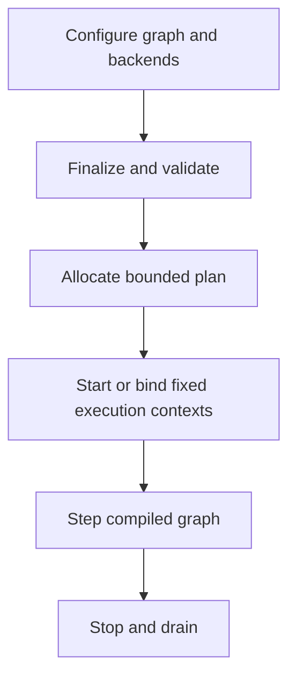

# Architecture

This page separates the supported 1.2 target runtime from compatibility and
candidate paths. The normative contract is the
[product contract](product_contract.md); the decisions behind it are recorded
in [ADRs](adr/README.md).

## Current 1.2 implementation

### Target host, device, distribution, SDK, and M15 policy runtime

`rt::Runtime` is the first target-path component. It owns a strict
configure/finalize/start/step/stop state machine, a finalization-time graph
compiler, frozen phase/resource topology, a finalized aligned scratch/queue/
trace memory plan, a runtime-local clock, an explicit numerical helper policy,
one runtime-owned or borrowed host CPU executor, optional
watchdog/degradation state, and a
fixed-capacity platform-preflight report.

M6 replaces the target path's shared trace lock with fixed atomic telemetry
slots. It adds stable event/metric IDs, cumulative and caller-cursor interval
windows, exact trace-sequence loss reporting, and immutable
version/build/config/workload metadata. Export is explicitly a non-RT host
operation; the runtime creates no exporter thread and performs no output I/O.

M7 adds an explicit D0/D1 determinism contract, caller-owned canonical state
registration, bounded versioned checkpoint and input-log artifacts, validated
transactional restore, and synchronous replay. Artifact parsing and runtime
identity checks allocate nothing. D2 reproducible-build and D3 portable
determinism remain unsupported and fail configuration rather than silently
weakening the requested tier.

M8 adds a C-compatible backend ABI, borrowed registered buffers, graph device
phases, a preallocated outstanding table, and one runtime-owned completion
service lane. A command provider runs on the CPU team and returns after bounded
submission. Its graph token remains pending until the poll lane publishes a
completion, so dependent phases are released without parking a compute worker.
The ABI has no completion callback, and stop joins the service lane before
unregistering buffers and shutting down backends. The included deterministic
CPU mock injects saturation, delay, timeout, error, and loss/reset behavior;
it is not a hardware backend.

M9 implements a separate optional CUDA Driver API backend around a host-owned
context and stream set. It pre-creates fixed event slots, supports explicit
copies and fixed-payload kernel launch, integrates through the unchanged M8
ABI, and has a CPU-only injected-driver test suite. It remains a candidate
because no versioned hardware support tuple has passed the required resource,
failure/recovery, and latency gates.

M10 adds a separate Xilinx XDMA AXI-MM character-device candidate for the
named upstream Linux driver stack. Blocking character-device I/O is confined
to a fixed initialization-time worker team; the M8-facing submit and poll
paths remain bounded. Its injected-driver tests cover saturation, timeout
quarantine, recovery, concurrency, and steady-state allocation freedom. It
remains unqualified until one declared PCI/driver/bitstream tuple passes the
published hardware evidence gates.

M11 adds the third `host_adapter` executor policy without creating another task
representation. The runtime passes immutable graph/range/reduction records,
aligned scratch, and generation-tagged completion context to a borrowed,
capacity-matched host job system. It also freezes C ABI v8, hides non-C
symbols, checks an exact export allowlist, and validates relocated installed
package consumers. The C++ API remains source-only.

M12 closes the portable RT0 release contract. It names the supported
compiler/OS tuples, adds an independent-device-state concurrency gate, applies
same-major package and target C++ source-compatibility policy, and checks
strict CPack staging plus content-addressed package and hardware-evidence
manifests. These gates do not promote RT1, RT2, CUDA, or XDMA qualification.

M15-01 added the policy/resource model, and M15-02 added native runtime-owned
thread application/readback behind a held startup gate. M15-03 adds one copied,
size/versioned provider table with acquire/apply/observe/rollback/release
callbacks. It can back exactly phase scratch, task scratch, and trace storage.
Finalization acquires active regions in that order and constructs executor and
telemetry owners in validated usable spans. Startup applies and observes memory
before the thread gate. Strict failure and later thread/device-start failure
quiesce lanes and reverse memory operations; checked stop destroys owners and
releases provider tokens in reverse order.
Live tokens and allocation extents are registered across runtime instances so
a shared provider cannot alias ownership or storage between runtimes.

The default path retains aligned-new behavior. Linux page policy uses
process-local `mmap` with rounded inaccessible guards and aligned usable bases,
an explicit `MAP_HUGETLB` attempt with requested fallback, caller/prefault page
touch, `mlock`, and `mincore` residency observation. Locking-only allocations
are page-backed independently so page-granular unlock cannot affect another
runtime. `mlock` is not independent lock readback or device/DMA pinning. Caller,
host-adapter, XDMA, and vendor
roles remain verify-only, with opaque cardinality left unknown. Stable memory
rows still project the plan exactly once; fragmented control allocations,
stack residency, exact external/backend accounting, and full byte closure
remain M15-04 work. See the
[CPU/memory policy contract](cpu_memory_policy.md).

Host-driven `step()` receives frame index, simulation delta, and an optional
deadline. It waits synchronously without pacing while dependency-ready phases
run on static-assignment, bounded-throughput, or borrowed-host policy.
Finalization
rejects invalid/foreign handles, cycles, unordered conflicting resource access,
an undersized graph queue plan, task-scratch underprovisioning, and a plan over
the configured memory budget. Nested ranges and deterministic-tree reductions
use the same executor.

Finite self-paced `run_periodic()` uses absolute epoch-based releases on the
calling frame thread and reports release, wake, start, finish, slack, deadline
miss, watchdog, and degradation data. A configured watchdog has one service
lane but never invokes host code; the frame thread applies degradation after
the graph returns. Optional strict Linux preflight is read-only and runs before
runtime threads start. See the
[time/platform contract](time_platform.md).

Stable C ABI v8 mirrors this lifecycle with size/version-checked structures,
an explicit compatibility handshake, and encoded graph handles. See the
[C ABI contract](c_abi.md), the
[host runtime contract](host_runtime.md) and
[compiled graph contract](compiled_graph.md), the
[executor contract](executor.md), and the
[memory-plan contract](memory_plan.md), the
[observability contract](observability.md), and the
[determinism/replay contract](determinism_replay.md), and the
[device backend contract](device_backend.md).

### Legacy simulation path

`SimCore` owns a phase graph, an internal range-worker team, frame arenas,
metrics hooks, tracing, pacing, adaptation, snapshots, and a separate
`FiberPool`. It creates worker threads in its constructor and `run()` owns a
self-paced loop.

Phases are grouped into topological levels. Dependencies order those levels,
while enabled phases in one level may run concurrently. A phase can contain:

- serial callbacks;
- chunked range callbacks;
- ordinary reductions;
- deterministic range reductions.

The demo exercises independent input, physics, AI, and audio work followed by
dependent constraint, integration, and telemetry phases.

### Important limitations

- `buildTopoLevels()` does not report a cycle as a configuration error.
- `SimCore`, `WorkerPool`, `rt::Scheduler`, and `FiberPool` remain compatibility
  experiments with different task and lifetime rules. `rt::Runtime` does not
  invoke them.
- `WorkerPool` has one bounded global FIFO queue. Its normal dequeue path does
  not honor `Job::priority`; its “steal” counter measures unsuccessful polling
  while work is outstanding, not successful cross-worker steals.
- `SimCore::run()` sleeps and advances its own wall-clock schedule, so it is
  not yet suitable as a host-driven engine step.
- construction and some running paths allocate, lock, perform file I/O, or
  create threads. The frame arena can use heap fallback after Release overflow.
- legacy global trace and floating-point state prevent clean isolation of
  multiple `SimCore` instances. The M1 `rt::Runtime` does not use those globals.
- the legacy HAL memory flags are no-ops, and its GPU path is a detached
  CPU-thread mock outside `rt::Runtime`.

These are tracked in the [roadmap](roadmap.md), not hidden behind feature
claims.

## Target architecture

The complete target lifecycle is configure, finalize, start, run, and stop:

Finalization compiles phase dependencies and resource hazards into an immutable
execution plan. One executor boundary runs CPU work under a selected policy.
Device backends receive bounded submissions and publish completions; CPU
workers do not block on device futures.

M1 implements the state machine and host-driven callback path. M2 compiles and
freezes dependency/resource topology. M3 creates the fixed team in `start()`
and routes graph and nested CPU work through it. M4 creates the finalized
memory plan, aligned execution-context scratch, and bounded frame-overload
policy. M5 adds the distinct absolute-release loop, one-shot watchdog with
frame-thread degradation, and fail-closed prerequisite reporting. M6 adds
bounded schema-v1 trace/counter emission and isolated non-RT export cursors.
M7 adds D1 schedule-independent identity, canonical registered state, bounded
checkpoint/input-log codecs, transactional restore, and synchronous replay.
M8 adds the poll-only device ABI, graph-held device completion tokens,
preallocated device-manager storage, and deterministic mock.
M9 adds the optional CUDA candidate without coupling the scheduler to vendor
headers or changing the portable device contract. M10 adds the optional Linux
XDMA AXI-MM candidate, likewise behind the unchanged M8 contract and a separate
support matrix.
M11 adds the borrowed host job-system policy and stable distribution boundary.
M12 names the portable RT0 support tuples and makes the 1.x compatibility,
release archive, digest-manifest, and independent-device-isolation gates
machine-verifiable.
M15-02 extends the immutable CPU/memory inventory with per-role native thread
apply/readback and a fail-closed startup barrier. M15-03 adds the isolated
three-region memory transaction without changing the C or device ABI. Provider
callbacks remain control-path-only; provider-backed checked stop makes trace
unavailable after its backing token is released.
See the [determinism/replay contract](determinism_replay.md),
[device backend contract](device_backend.md),
[CUDA backend contract](cuda_backend.md),
[XDMA backend contract](xdma_backend.md),
[ADR-0001](adr/0001-one-executor-boundary.md),
[ADR-0002](adr/0002-host-driven-time.md), and
[ADR-0003](adr/0003-device-backend-boundary.md), and the
[runtime profile contract](runtime_profiles.md).

## Memory layout utilities

The repository includes SoA/AoSoA containers and SIMD-oriented kernels. They
are optional utilities, not a required application data model and not evidence
that arbitrary host data is automatically optimized.

## Code anchors

- M1–M14 host/device runtime and 1.2.1 lifecycle-safety closure:
  `rt::Runtime`; `rt/include/rt/runtime.hpp`,
  `rt/src/host_runtime.cpp`
- M2 graph compiler: `rt/src/compiled_graph.cpp`
- M3 executor: `rt/src/executor.cpp`
- M11 host adapter and stable distribution: `rt/src/executor.cpp`,
  `rt/include/rt/c_api.h`, `docs/c_abi.md`, `tests/package_consumer`
- M12 portable release contract: `docs/portable_support_matrix.json`,
  `docs/release_policy.md`, `release/rtfw-release-contract.json`,
  `tools/check_release_contract.py`, `tools/stage_release_artifacts.py`,
  `tools/extract_release_archive.py`, `tools/release_manifest.py`,
  `tools/check_hardware_evidence.py`,
  `tests/test_release_tools.py`, `.github/workflows/release.yml`
- M13 runtime profiles/autotune: `rt/include/rt/profile.hpp`,
  `rt/src/runtime_profile.cpp`, `src/runtime_profile_demo.cpp`,
  `tools/autotune/config.schema.json`, `tools/autotune/spec.yaml`,
  `docs/runtime_profiles.md`
- M14 SDK/package boundary: `rtfw::runtime`, `rt/include/rt/config.hpp`,
  `rt/include/rt/status.hpp`, `rt/include/rt/canonical_bytes.hpp`,
  `cmake/rtfwConfig.cmake.in`, `tests/package_consumer/package_contract.cmake`
- M15-01 policy model/inventory: `rt/include/rt/config.hpp`,
  `rt/include/rt/runtime.hpp`, `rt/src/resource_policy.cpp`,
  `docs/cpu_memory_policy.md`, `tests/test_cpu_memory_policy.cpp`
- M15-03 resident-region transaction: `rt/src/memory_policy.cpp`,
  `rt/src/memory_policy.hpp`, `tests/test_memory_policy.cpp`
- M4 memory plan: `rt/src/aligned_storage.hpp`,
  `docs/memory_plan.md`
- M5 time/platform controls: `rt/src/watchdog_monitor.cpp`,
  `rt/src/native_platform_preflight.cpp`, `docs/time_platform.md`
- M6 observability: `rt/src/telemetry.cpp`,
  `rt/src/observability_export.cpp`, `docs/observability.md`
- M7 determinism/replay: `rt/src/snapshot_codec.cpp`,
  `docs/determinism_replay.md`
- M8 device ABI/manager/mock: `rt/include/rt/device_abi.h`,
  `rt/src/device_manager.cpp`, `rt/src/mock_device.cpp`,
  `docs/device_backend.md`
- M9 CUDA candidate: `rt/include/rt/cuda_backend.hpp`,
  `rt/src/cuda_backend.cpp`, `rt/src/cuda_driver.cpp`,
  `docs/cuda_backend.md`
- M10 XDMA candidate: `rt/include/rt/xdma_backend.hpp`,
  `rt/include/rt/xdma_linux.hpp`, `rt/src/xdma_backend.cpp`,
  `rt/src/xdma_linux.cpp`, `docs/xdma_backend.md`
- Stable C lifecycle ABI: `rt/include/rt/c_api.h`, `src/c_abi.cpp`
- Phase registration and graph: `SimCore::addPhase`,
  `SimCore::addDependency`, `SimCore::buildTopoLevels`;
  `include/simcore/SimCore.hpp`
- Internal range execution: `SimCore::initThreads`,
  `SimCore::executeFrame`; `include/simcore/SimCore.hpp`
- Optional global-queue pool: `WorkerPool`; `include/simcore/worker_pool.hpp`
- Separate research scheduler: `rt::Scheduler`; `rt/include/rt/scheduler.hpp`
- Data-layout utilities: `include/simcore/car_soa.hpp`,
  `include/simcore/soa/`
