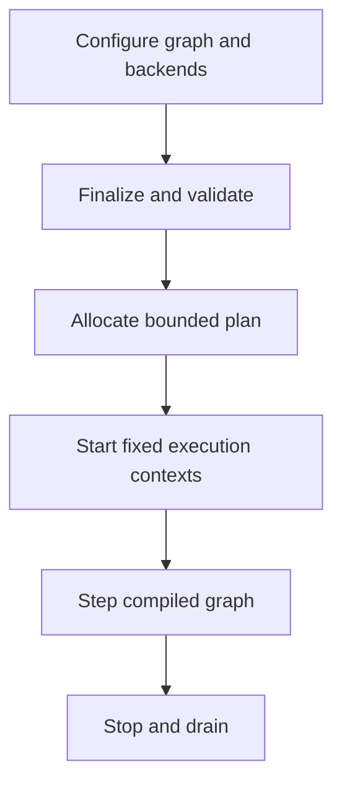

# Architecture

This page separates the 0.6 implementation from the accepted target
architecture. The normative target is the
[product contract](product_contract.md); the decisions behind it are recorded
in [ADRs](adr/README.md).

## Current 0.6 implementation

### M1–M5 host runtime

`rt::Runtime` is the first target-path component. It owns a strict
configure/finalize/start/step/stop state machine, a finalization-time graph
compiler, frozen phase/resource topology, a finalized aligned scratch/queue/
trace memory plan, a runtime-local clock, an explicit numerical helper policy,
one fixed CPU worker team, optional watchdog/degradation state, and a
fixed-capacity platform-preflight report.

Host-driven `step()` receives frame index, simulation delta, and an optional
deadline. It waits synchronously without pacing while dependency-ready phases
run on either a static-assignment or bounded-throughput policy. Finalization
rejects invalid/foreign handles, cycles, unordered conflicting resource access,
an undersized graph queue plan, task-scratch underprovisioning, and a plan over
the configured memory budget. Nested ranges and deterministic-tree reductions
use the same executor.

Finite self-paced `run_periodic()` uses absolute epoch-based releases on the
calling frame thread and reports release, wake, start, finish, slack, deadline
miss, watchdog, and degradation data. A configured watchdog has one service
lane but never invokes host code; the frame thread applies degradation after
the graph returns. Optional strict Linux preflight is read-only and runs before
runtime threads start. See the
[time/platform contract](time_platform.md).

The experimental C ABI mirrors this lifecycle with size/version-checked
structures and encoded graph handles. See the
[host runtime contract](host_runtime.md) and
[compiled graph contract](compiled_graph.md), the
[executor contract](executor.md), and the
[memory-plan contract](memory_plan.md).

### Legacy simulation path

`SimCore` owns a phase graph, an internal range-worker team, frame arenas,
metrics hooks, tracing, pacing, adaptation, snapshots, and a separate
`FiberPool`. It creates worker threads in its constructor and `run()` owns a
self-paced loop.

Phases are grouped into topological levels. Dependencies order those levels,
while enabled phases in one level may run concurrently. A phase can contain:

- serial callbacks;
- chunked range callbacks;
- ordinary reductions;
- deterministic range reductions.

The demo exercises independent input, physics, AI, and audio work followed by
dependent constraint, integration, and telemetry phases.

### Important limitations

- `buildTopoLevels()` does not report a cycle as a configuration error.
- `SimCore`, `WorkerPool`, `rt::Scheduler`, and `FiberPool` remain compatibility
  experiments with different task and lifetime rules. `rt::Runtime` does not
  invoke them.
- `WorkerPool` has one bounded global FIFO queue. Its normal dequeue path does
  not honor `Job::priority`; its “steal” counter measures unsuccessful polling
  while work is outstanding, not successful cross-worker steals.
- `SimCore::run()` sleeps and advances its own wall-clock schedule, so it is
  not yet suitable as a host-driven engine step.
- construction and some running paths allocate, lock, perform file I/O, or
  create threads. The frame arena can use heap fallback after Release overflow.
- legacy global trace and floating-point state prevent clean isolation of
  multiple `SimCore` instances. The M1 `rt::Runtime` does not use those globals.
- the HAL memory flags are no-ops, and the GPU path is a detached CPU-thread
  mock.

These are tracked in the [roadmap](roadmap.md), not hidden behind feature
claims.

## Target architecture

The complete target lifecycle is configure, finalize, start, run, and stop:

Finalization compiles phase dependencies and resource hazards into an immutable
execution plan. One executor boundary runs CPU work under a selected policy.
Device backends receive bounded submissions and publish completions; CPU
workers do not block on device futures.

M1 implements the state machine and host-driven callback path. M2 compiles and
freezes dependency/resource topology. M3 creates the fixed team in `start()`
and routes graph and nested CPU work through it. M4 creates the finalized
memory plan, aligned execution-context scratch, and bounded frame-overload
policy. M5 adds the distinct absolute-release loop, one-shot watchdog with
frame-thread degradation, and fail-closed prerequisite reporting. See
[ADR-0001](adr/0001-one-executor-boundary.md),
[ADR-0002](adr/0002-host-driven-time.md), and
[ADR-0003](adr/0003-device-backend-boundary.md).

## Memory layout utilities

The repository includes SoA/AoSoA containers and SIMD-oriented kernels. They
are optional utilities, not a required application data model and not evidence
that arbitrary host data is automatically optimized.

## Code anchors

- M1–M5 host runtime: `rt::Runtime`; `rt/include/rt/runtime.hpp`,
  `rt/src/host_runtime.cpp`
- M2 graph compiler: `rt/src/compiled_graph.cpp`
- M3 executor: `rt/src/executor.cpp`
- M4 memory plan: `rt/src/aligned_storage.hpp`,
  `docs/memory_plan.md`
- M5 time/platform controls: `rt/src/watchdog_monitor.cpp`,
  `rt/src/native_platform_preflight.cpp`, `docs/time_platform.md`
- Experimental C lifecycle ABI: `rt/include/rt/c_api.h`, `src/c_abi.cpp`
- Phase registration and graph: `SimCore::addPhase`,
  `SimCore::addDependency`, `SimCore::buildTopoLevels`;
  `include/simcore/SimCore.hpp`
- Internal range execution: `SimCore::initThreads`,
  `SimCore::executeFrame`; `include/simcore/SimCore.hpp`
- Optional global-queue pool: `WorkerPool`; `include/simcore/worker_pool.hpp`
- Separate research scheduler: `rt::Scheduler`; `rt/include/rt/scheduler.hpp`
- Data-layout utilities: `include/simcore/car_soa.hpp`,
  `include/simcore/soa/`
